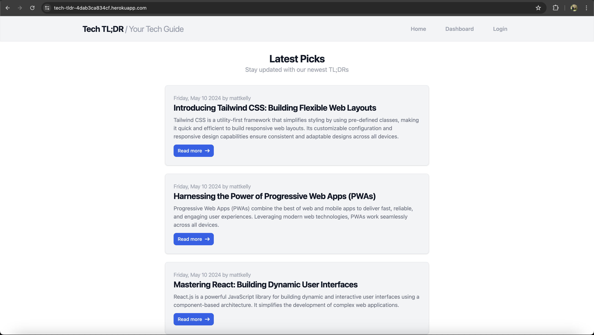
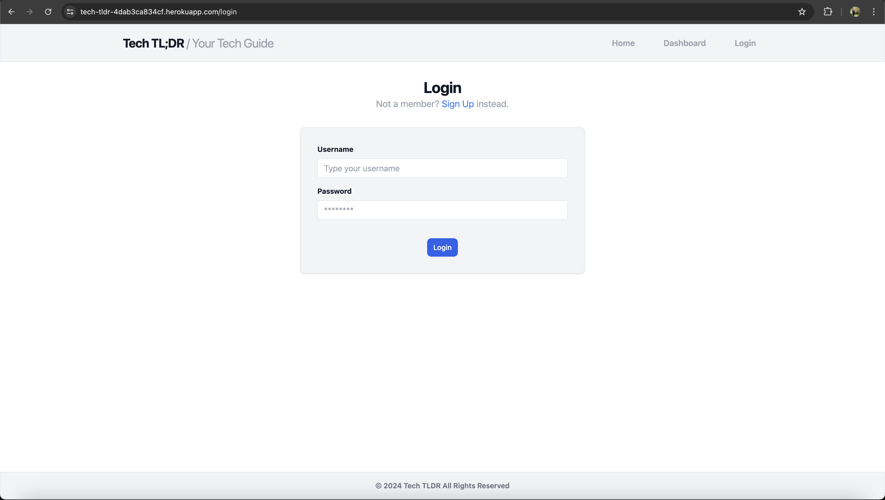
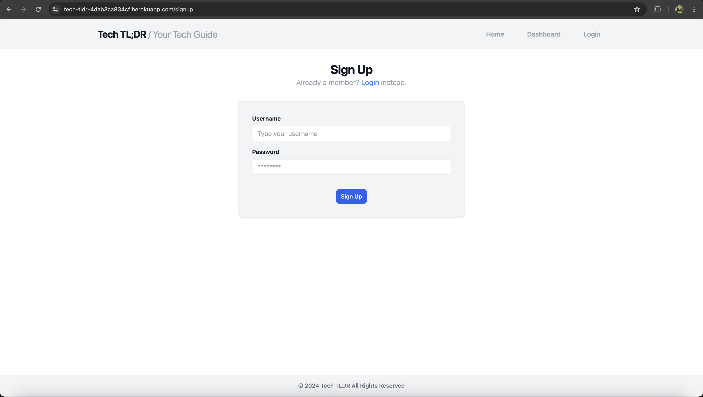
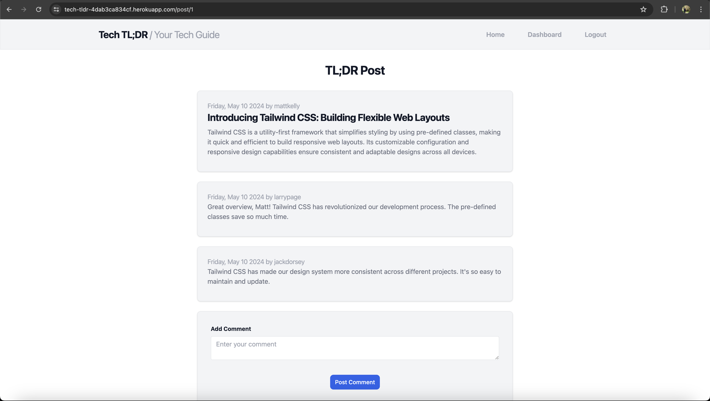
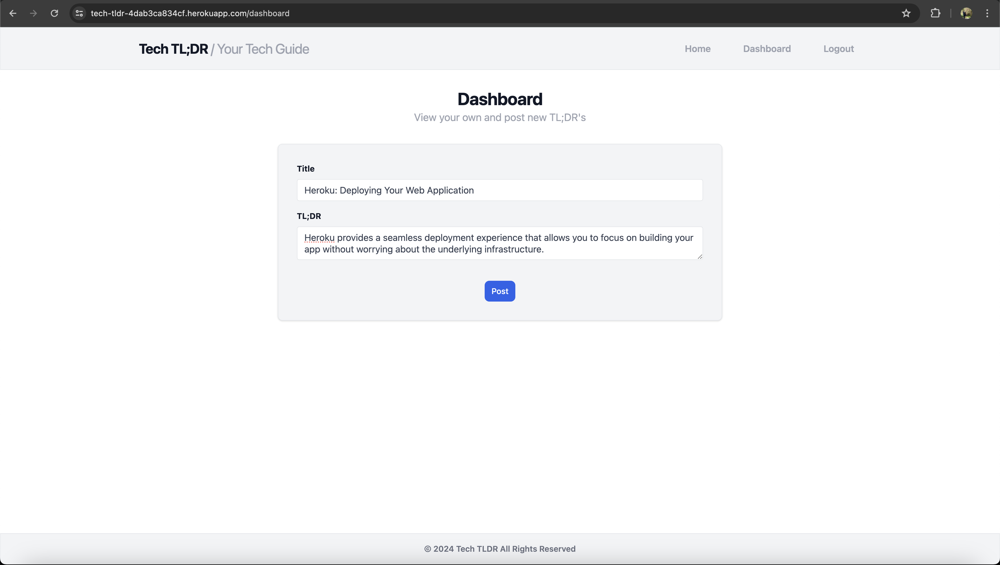
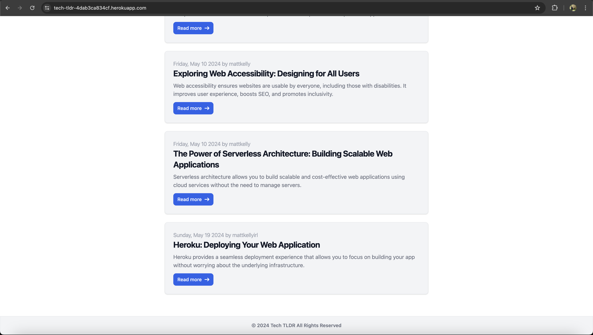
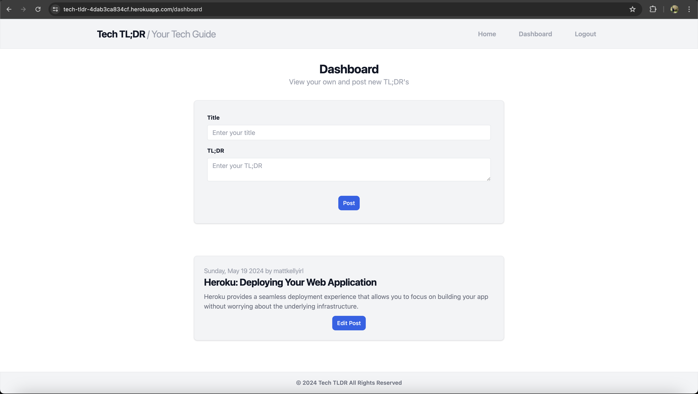
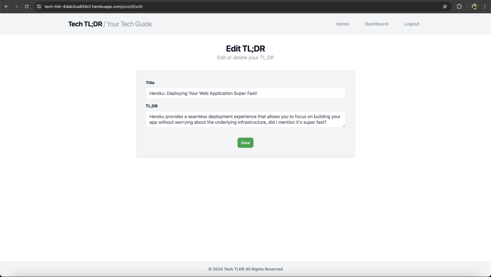

# Tech TL;DR

## Description

Stay up to date with the latest tech news and developments with this TL;DR style tech blog built with Express.js, Handlebars.js, Sequelize, and MySQL.

## Table of Contents

- [Description](#description)
- [Installation](#installation-instructions)
- [Usage](#usage)
- [Contribution](#contribution-guidelines)
- [Tests](#tests)
- [License](#license)
- [Questions](#questions)

## Installation Instructions

To install this application, clone this repository to your local machine and install all relevant packages by executing **'npm install'**. Please note, Node.js must be installed on your local machine for this application to run.

## Usage

To use this application, navigate to the Heroku [link](https://tech-tldr-4dab3ca834cf.herokuapp.com/).

Welcome to the Tech TL;DR blog! Here you can stay up to date with the latest tech news and developments.

To get started, navigate to the **Login** link in the navigation bar. If you are already a member, log in with your username and password:

If you are not a member, click the **Signup** link and choose your username and password:

Once signed in, you will be redirected to the homepage. Click **Read more** on any of the existing TL;DR posts to view the post and its associated comments:

Only members can write new posts and comments. To write your first post, click on the **Dashboard** link in the navigation bar and share your tech thoughts with the world!

Once your post has been submitted, you will be redirected to the homepage where you can view your latest blog post:

Your posts will also be visible in your dashboard. If you choose to edit one of your posts, click the **Edit post** button:

Re-write your post and hit save! When saved, you will be redirected to the homepage where you can view your updated post:

**_Please note: For maximum security purposes, session cookies will expire after 2 minutes of user inactivity. Users will be prompted to log in again when attempting to make any member-restricted actions (posting/commenting) after their session cookie expires._**

## Contribution Guidelines

This project was developed by Matt Kelly.

## Tests

There are no tests associated with this project.

## License

This project is not licensed. For more information regarding licenses, please visit this link: [Open Source Licenses](https://opensource.org/license/).

## Questions

Please feel free to contact me via my GitHub or email below for any questions associated with this application:  
GitHub: [mattkellyirl](https://github.com/mattkellyirl)  
Email: [mattkellyvisual@gmail.com](mailto:mattkellyvisual@gmail.com)
